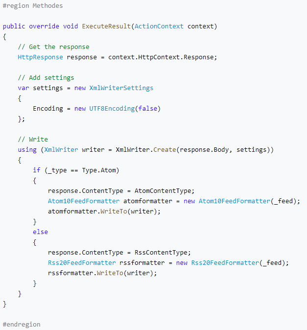
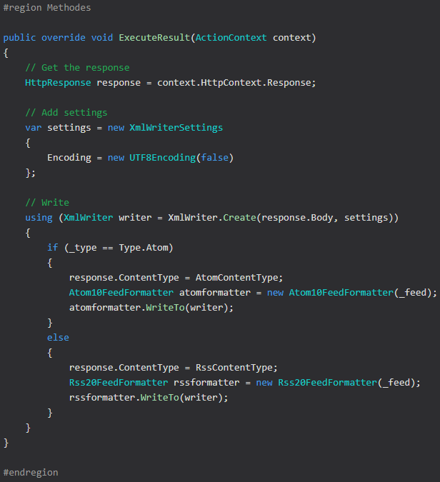

# Introduction

This project include themes for [Prism JS](https://prismjs.com/). Those theme are based on the Visual Studio 2019 colors.

At this time, 2 themes are available :
- Visual Studio Light (prismjs-vs-light)


- Visual Studio Light (prismjs-vs-dark)


# Languages supported
Themes were optimized for : C#, C (and C-Like), CSS, Java Script, Json, Markup, HTML, XML, Powershell, SASS (SCSS), SQL, YAML.

But it should support all others the language.

# Installation
```
npm install prismjs-vs
```

# Usage
Include the CSS of the them that you would like to use in your HTTP Header. CSS files are in the DIST folder.

```
<!DOCTYPE html>
<html>
<head>
	...
    <link href="themes/prismjs-vs-light.css" rel="stylesheet" />
</head>
<body>
	...
    <script src="prism.js"></script>
</body>
</html>
```
# Advanced
You can use the SASS files to customize the themes. SASS files are in the SCSS folder.

| File                | Description |
|-|-|
| _prism-vs.scss      | Contain all CSS for prism JS. Requiered by theme files. |
| prism-vs-dark.scss  | Set all colors to obtain the dark theme. @import the _prism-vs.scss file.|
| prism-vs-light.scss | Set all colors to obtain the light theme. @import the _prism-vs.scss file.|

# Contribute

Contributions are open. Juste send your ideas or Pull Request ;)

# Build
If you want to contribute to this project, you should have to build this one. The build process use NPM scripts. To run build, use this command.
```
npm run build
```
